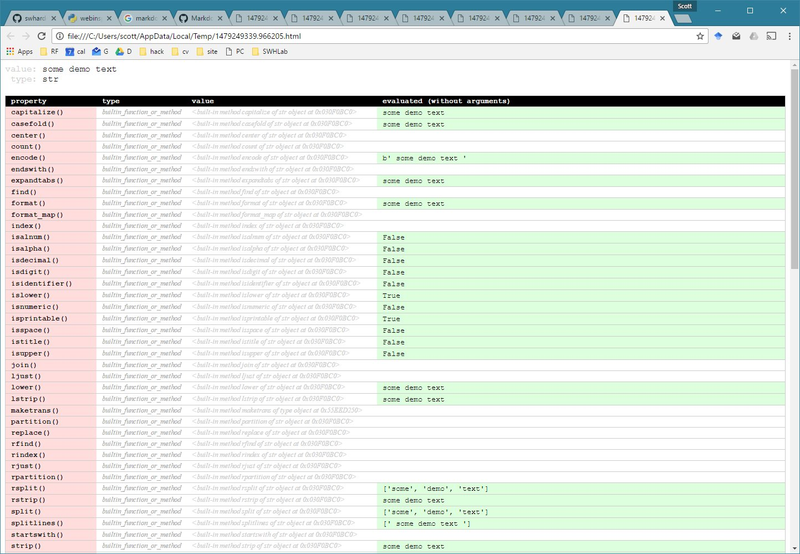

**webinspect** allows python developers to learn about objects' methods by displaying their properties in a web browser. This is extremely useful when trying to figure out how to use confusing and/or poorly documented classes. Just stick `webinspect.launch(someObject)` anywhere in your code and a web browser will automatically launch displaying all of the information about the object.

## Installation
* `pip install webinspect`
* Details are on the [PyPi/webinspect](https://python.org/pypi/webinspect) page

## Usage
```python
import webinspect
someObject=" some demo text "
webinspect.launch(someObject)
```

## Example Output (string object)


## Complex Example (neoIO AnalogSignal object)


## Preventing methods from being fun
Webinspect naturally pokes around the methods of objects. If the thing you're inspecting is a string it may have a method "upper()", so naturally webinspect will call `thing.upper()` to see what it returns. Often this is harmless, but what if you want to prevent calling functions such as `thing.destroy()`? To account for this, a _blacklist_ has been added. If the name of any property matches an item in the blacklist, it is skipped-over. This is useful for poking around NeoIO, PyOrigin, and anything with potentially damaging methods.

Here's an example from [SWHLab's core ABF handler](https://github.com/swharden/SWHLab/search?utf8=%E2%9C%93&q=inspect%28self%29&type=Code):
```python
webinspect.blacklist=[] # clears the blacklist
webinspect.launch(self.ABFblock.segments[0].eventarrays[0],'self.ABFblock.segments[0].eventarrays[0]')
webinspect.blacklist=['parents'] # prevents parents() from being executed
webinspect.launch(self.ABFblock.segments[5].analogsignals[0],'self.ABFblock.segments[5].analogsignals[0]')
webinspect.blacklist=['t_start','t_stop'] # prevents t_start() and t_stop() from beeing executed
webinspect.launch(self.ABFblock.segments[5],'self.ABFblock.segments[5]')
webinspect.blacklist=[] # clears the blacklist
webinspect.launch(self.ABFblock,'self.ABFblock')
webinspect.blacklist=[] # clears the blacklist
webinspect.launch(self.ABFreader,'self.ABFreader')
```

You can often tell which methods you need to blacklist, because they're the ones that appear immediately before Python crashes during an inspection.
